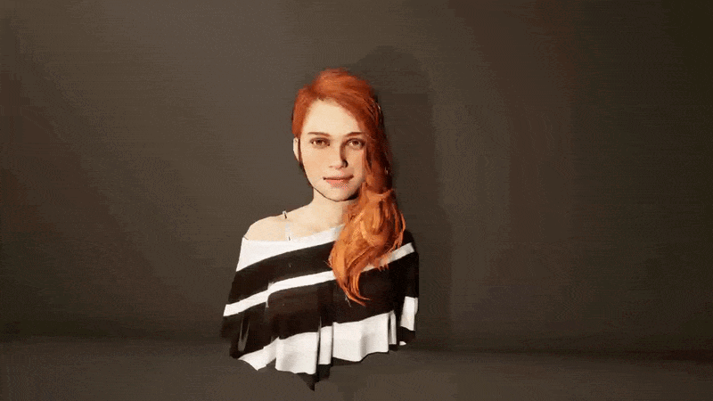
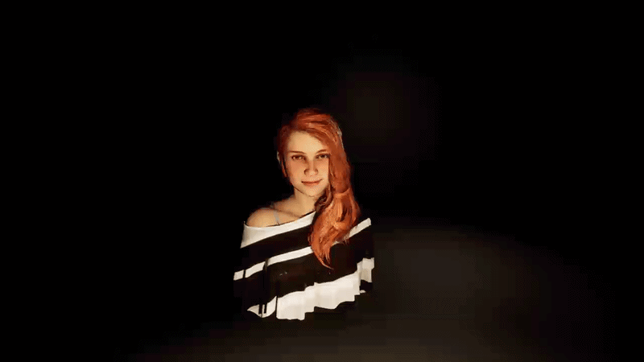
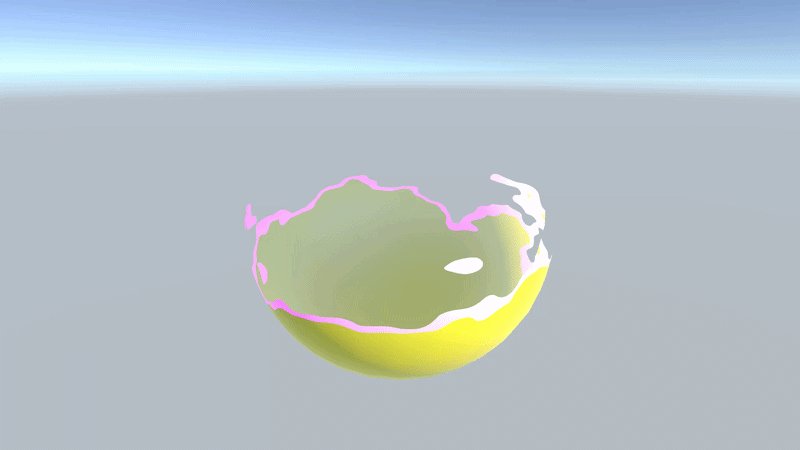
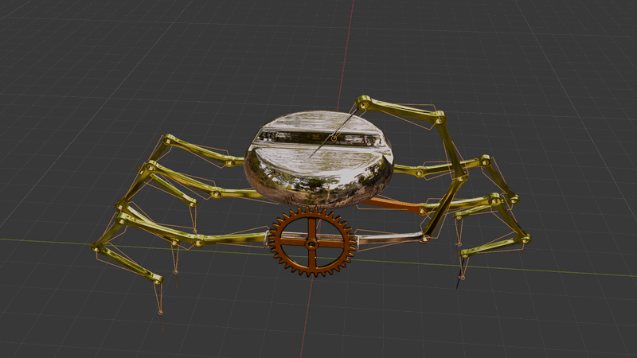
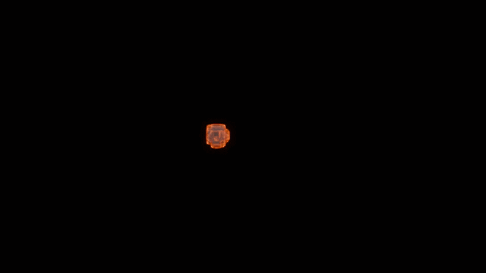

## 🌗 风格化写实角色展示（白天 / 夜晚）

  

这个部分是基于给定资产做的一个风格化写实角色展示（具体请见风格化.doc），主要目标是：

- 在不依赖现成插件的情况下，自己实现材质风格控制
- 让角色在白天 / 夜晚两种光照环境下都有良好的表现
- 在保证效果的同时，尽量控制性能开销

---

## ☀️ 白天场景设计思路

白天环境主要使用较强的主光源（Directional Light），整体偏真实风格：

- 使用较高强度的平行光模拟太阳光
- 阴影偏硬，强调结构细节
- 环境光（Ambient）偏冷色，用来平衡高光部分

在这个场景下，重点是让材质的细节（法线 / 粗糙度）能够被正确表现出来，避免“糊”或者“过曝”。

---

## 🌙 夜晚场景设计思路

夜晚环境整体偏风格化：

- 主光源强度降低，使用冷色调（蓝紫）
- 增加环境光和局部补光（Fill Light）
- 强化发光材质（Emission）的表现

夜晚的重点不是“真实”，而是通过材质和光照去强化氛围和视觉引导。

---

## 🧪 材质实现与原理

这个项目中没有使用现成的 Shader 插件，主要基于引擎标准管线做了一些调整。

### 🎨 基础材质（PBR）

大部分模型使用标准 PBR 材质：

- Albedo（基础色）：控制整体颜色
- Normal（法线）：增强表面细节
- Roughness（粗糙度）  
  - 值低 → 更光滑（反射强）  
  - 值高 → 更粗糙（漫反射为主）

在白天场景中，通过 Roughness 区分不同材质（皮肤 / 金属 / 布料）。  
在夜晚场景中，适当提高 Roughness，避免高光过亮导致发白。

---

### ✨ Emission（自发光材质）

用于角色能量部分或高亮区域：

- 使用 Emission 控制亮度与颜色
- 在夜晚场景中适当提高强度

实现方式：

- 基于贴图控制发光区域
- 使用参数控制整体颜色（偏蓝 / 偏橙）

作用主要是增强视觉焦点，并在低光环境中提升可读性。

---

### 🌫 风格化控制

为了贴近“风格化写实”，做了一些调整：

- 降低真实反射强度，避免金属过亮
- 控制整体对比度，让画面更统一
- 夜晚统一冷色调氛围

整体思路是在真实基础上做一定的风格偏移。

---

### 🔄 日夜统一处理

同一套材质需要适配两个环境，主要做了：

- 使用中性 Albedo，避免偏色
- Roughness 控制在合理范围
- Emission 单独控制（夜晚增强）

这样可以做到白天看细节，夜晚看氛围。

---

## 🎬 其他效果展示

### 溶解效果

---

这个效果主要是通过噪声贴图控制模型逐渐消失的过程，同时在边缘加了一层发光来增强视觉反馈。

实现上核心是一个阈值驱动的溶解过程，通过控制 cutoff 来决定模型哪些部分被剔除。为了避免边缘过于生硬，我额外做了一个过渡区间，让消失看起来更自然一点。

这一块主要是在练习 Shader 的基础控制逻辑，以及如何让一个“简单效果”看起来更有节奏。

### 探测器效果

---

这个效果是基于**骨骼绑定（Skeletal Binding）**做的一个扫描型动画效果。

模型本身绑定在一个简单骨骼结构上，通过控制骨骼的局部旋转和位移来驱动扫描区域的变化，而不是单纯用缩放或粒子去模拟。

这样做的好处是整体运动会更“跟模型走”，不会出现效果和模型脱节的情况，同时也更容易和动画系统结合。

扫描的扩散感是通过时间参数去驱动骨骼逐步变化，再配合一个渐变贴图控制强弱，让整个过程看起来是持续推进的。

---

### 火球效果

---

火球主要是一个基础的能量体特效，包括中心高亮、外层渐变以及轻微的动态扰动。

这一块主要是在练习如何让一个发光效果在不同背景下依然清晰，而不会被场景颜色“吞掉”。

在实现上没有做复杂系统，更多是通过颜色分层和简单的动画变化，让整体看起来有能量流动感。

### 小游戏 Demo

---
---

### 🎮 小游戏 Demo（Game）

Game

这个 Demo 是在前面所有效果的基础上做的一个简单可交互小游戏，用来验证这些 Shader 和特效在实际运行中的表现，同时也顺便练了一些基础 Gameplay 逻辑的实现。

整体结构不复杂，但有做一些完整的机制设计，而不是单纯播放效果。

---

#### ⚙️ 核心玩法与实现

这个 Demo 主要实现了几个基础但完整的游戏机制：

**1. 击退（Knockback）系统**

玩家在攻击或触发碰撞时，会对目标产生一个方向性的击退效果。

实现方式是基于角色当前位置与目标位置计算方向向量，然后叠加一个瞬时力或位移，让角色产生物理反馈。

在调试过程中重点是控制“击退感”，既不能太弱没有反馈，也不能太强导致失控，所以对力度衰减和持续时间做了控制。

---

**2. 边界与上下层结构设计**

场景中做了一个基础的边界系统，用来限制角色移动范围，防止出界。

同时在视觉层级上做了简单的“上下层”处理，让角色在不同区域移动时有一定的空间感，而不是完全平面化。

这一部分主要是通过层级判定和简单的空间区间划分来实现的。

#### 💡 开发过程中的重点

这一部分做下来最大的感受是，真正的难点不是写一个效果，而是把效果放进一个“可玩的逻辑系统”里。

比如击退效果如果不结合碰撞和状态管理，很容易变成纯视觉反馈；边界系统如果只做限制，会显得很生硬，所以需要配合视觉层级一起设计。

---

整体来说，这个 Demo 更偏向一个“玩法验证场景”，主要用来测试：

- 基础 Gameplay 逻辑是否稳定  
- 简单场景结构是否合理
- 
## 🛠 技能总结

### 引擎 / 工具

- Unity（基础开发 / Shader / 场景搭建）
- Blender（建模 / 材质 / 简单处理）

---

### 技术美术方向

- PBR 材质原理（Albedo / Normal / Roughness）
- Emission / 溶解效果实现
- 不同光照环境下的材质调优
- 基础灯光设计（白天 / 夜晚）

---

### 优化相关

- 材质复用，减少 Draw Call
- 控制 Shader 复杂度
- 在效果与性能之间做权衡

